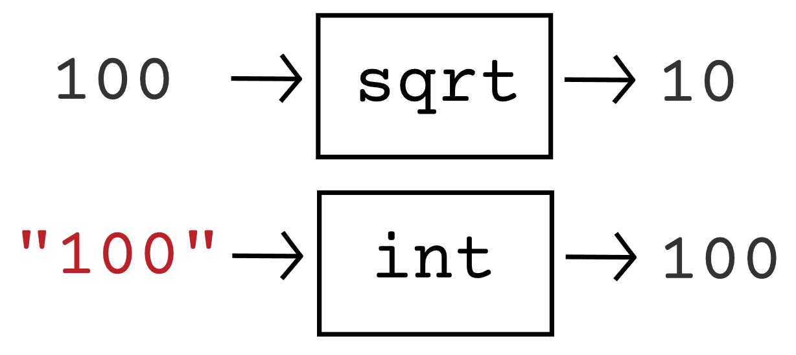
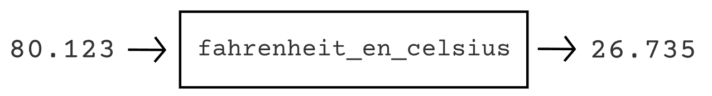

# Fonctions

## Qu'est-ce qu'une fonction ?

Nous avons déjà mentionné plusieurs fois le mot *fonction* dans ce
cours, notamment avec `print()` et `input()`, mais aussi avec `int()`,
`float()`, `sqrt()`, et `randint()`. De notre point de vue, nous avons
utilisé ces fonctions comme des sortes de boîtes noires dans lesquelles
nous avons envoyé une valeur (entre les parenthèses) pour, parfois, en
recevoir une autre en retour. La figure suivante schématise ce qu'il se
passe lorsque l'on exécute le code ci-dessous.

``` {code-block} python
:caption: Utilisation des fonctions sqrt() et int()
from math import *
x = sqrt(100)
y = int("100")
```



Nous ne savons en effet pas vraiment quelles opérations sont exécutées
lorsque l'on fait appel à ces fonctions. Tout ce que l'on sait, c'est
que l'on donne une certaine valeur à `sqrt()` et que celle-ci nous
retourne sa racine carrée. De même pour `int()`, à laquelle on donne une
certaine valeur et qui nous la retourne convertie en nombre entier.
Derrière ces fonctions se cachent pourtant de nombreuses lignes de code
écrites par d'autres programmeur.euses permettant de réaliser ces
opérations. Toutefois, il est bien plus pratique et lisible de
simplement écrire `sqrt()` ou `int()` que de recopier un algorithme
complexe à chaque fois que l'on veut effectuer une racine carrée ou une
conversion en nombre entier.\
Cela constitue l'intérêt principal des fonctions et on peut ainsi en
utiliser de nombreuses provenant directement de Python ou de modules que
l'on télécharge et importe dans notre programme. Dans ce chapitre, nous
allons voir comment vous pouvez vous-même créer vos propres fonctions.

## Définir une fonction

Comme première fonction, nous allons simplement en créer une nommée `saluer()`, ne prenant rien entre ses parenthèses, et permettant d'afficher des textes de salutation. Pour définir une fonction, il faut utiliser le mot-clef `def` et le faire suivre du nom qu'on souhaite lui donner ainsi que d'une paire de parenthèses. Comme souvent en Python, cette ligne doit se terminer par deux-points. Finalement, le bloc d'instructions à exécuter lorsque l'on appelle la fonction, nommé *corps* de la fonction, est indenté en dessous de la ligne de définition. Ainsi, la fonction `saluer()` peut-être définie de la manière suivante :

``` {code-block} python
:caption: Définition d'une fonction saluer()
def saluer():
    print("Bonjour")
    print("Comment allez-vous ?")
```

Que se passe-t-il lorsque vous exécutez ce programme ? Pour le moment, absolument rien. En effet, celui-ci permet uniquement de *définir* ce que fait la fonction `saluer()`. Si on veut afficher le texte de salutation, il faut alors utiliser cette fonction. Cela est très simple, il suffit d'écrire le nom de la fonction suivi d'une paire de parenthèse. Ainsi, le programme suivant permet d'afficher trois fois les messages de salutation.

``` {code-block} python
:caption: Définition et utilisation de la fonction saluer()
def saluer():
    print("Bonjour")
    print("Comment allez-vous ?")
saluer()
saluer()
saluer()
```

## Définir une fonction avec paramètres

Les fonctions que nous avons utilisées dans les précédents chapitres
prenaient toutes au moins une valeur entre leurs parenthèses. On appelle
ces valeurs des *paramètres*. Ainsi, on pourrait ajouter un paramètre à
notre fonction, de manière que l'on puisse ensuite écrire par exemple
`saluer("Maxime")` ou `saluer("Caroline")` de manière que cette fonction
salue à chaque fois un prénom différent.\
Pour ce faire, on doit indiquer au moment de définir la fonction que
celle-ci attend un paramètre. Sur la ligne du `def`, on doit alors
mettre le nom que l'on veut donner au paramètre entre la paire de
parenthèses. Un paramètre est en fait une variable, à la différence que
celle-ci tient sa valeur de l'appel à la fonction, et qu'elle n'est
utilisable que dans le corps de celle-ci. Le programme devient donc
comme suit pour afficher trois messages de salutation personnalisés.

``` {code-block} python
:caption: Définition et utilisation d'une fonction paramétrée saluer()
def saluer(prenom):
    print("Bonjour", prenom)
    print("Comment allez-vous ?")
saluer("Maxime")
saluer("Caroline")
saluer("Iliya")
```

Au début du programme, la ligne `saluer("Maxime")` est exécutée.
L'exécution saute alors à la ligne de définition de cette fonction et la
valeur`"Maxime"` est attribuée à la variable `prenom`. L'exécution du
corps de la fonction peut ensuite commencer, et le premier message
affiché sera bien `Bonjour Maxime`. Quand cette fonction est terminée,
l'exécution saute cette fois à la ligne `salut("Caroline")`, qui la
ramène immédiatement à la ligne de la définition de `saluer()` pour
attribuer la valeur `"Caroline"` à `prenom`. Ainsi de suite, le
paramètre prend différentes valeurs, et la fonction est exécutée en
fonction de cette valeur.\
Il est également possible de définir une fonction avec plusieurs
paramètres. Dans ce cas, les noms des différents paramètres doivent être
séparés par des virgules entre les parenthèses de la ligne de
définition. Lors de l'utilisation de la fonction, les valeurs doivent
également être séparées par des virgules et celles-ci sont attribuées
aux paramètres dans le même ordre. Dans le programme suivant, la fonction `quiz()` permet de poser une question à l'utilisateur, et de contrôler si sa réponse (un nombre) est correcte ou non. Il devient alors facile de créer un quiz en utilisant la fonction `quiz()` et en lui donnant la question comme premier argument, et la bonne réponse comme deuxième argument.

``` {code-block} python
:caption: Définition et utilisation d'une fonction quiz() avec plusieurs paramètres
def quiz(question, bonne_reponse):
    reponse_joueur = int(input(question))
    if bonne_reponse == reponse_joueur:
        print("Bonne réponse")
    else:
        print("Mauvaise réponse")
quiz("Combien il y a-t-il de cantons en Suisse ?", 26)
quiz("En quelle année Donald Trump est-il devenu président des USA ?", 2016)
quiz("Quel est le résultat de 2*(5+4)", 18)
```

## Passage par valeur

Comme nous l'avons déjà fait avec la fonction `print()`, il est tout à
fait possible de mettre des variables ou des expressions au lieu de
valeurs littérales entre les parenthèses d'un appel de fonction. Dans ce
cas, l'expression est tout d'abord évaluée, et son résultat est transmis
au paramètre. Ainsi, le programme ci-dessous est tout à fait valide et
affichera `Majeur Mineur Mineur`.

``` {code-block} python
:caption: Utilisation de variables ou expressions comme arguments
def affiche_mineur_majeur(age):
    if age >= 18:
        print("Majeur")
    else:
        print("Mineur")

affiche_mineur_majeur(20)
n = 7
affiche_mineur_majeur(n)
affiche_mineur_majeur( (n + 1) * 2 )
```

Il faut toutefois faire attention à un détail. Lorsque, par exemple, la
ligne `affiche_mineur_majeur(n)` est exécutée, la valeur de `n` est
**copiée** dans la variable `age`. Ainsi, une modification de `age` dans
le corps de la fonction ne peut avoir aucun impact sur la valeur de `n`.
On appelle cela un *passage par valeur* et ce concept s'illustre bien
dans le programme suivant qui affiche simplement 3 fois le nombre `20`.

``` {code-block} python
:caption: Exemple de passage par valeur
def affiche_double(x):
    x *= 2
    print(x)
n = 10
affiche_double(n)
affiche_double(n)
affiche_double(n)
```

## Définir une fonction avec valeur de retour

Dans le schéma présenté au début de ce chapitre, nous avions représenté
une fonction comme une boîte noire à laquelle nous donnions une (ou
plusieurs) valeur(s), et qui nous en retournait une autre. Pour
l'instant, nous avons appris à définir une fonction avec un corps, ce
qui correspond à la boîte noire. De plus, nous avons appris à ajouter
des paramètres à la fonction, ce qui correspond aux valeurs entrant dans
la boîte. Nous n'avons toutefois pas encore abordé la valeur qui sort de
la boîte, que l'on appelle *valeur de retour*.

Pour créer notre première fonction avec valeur de retour, reprenons
l'idée du programme convertissant des degrés Fahrenheit en degrés
Celsius que vous avez développé dans un exercice précédent. Il s'agit
d'un cas typique pour lequel nous aimerions définir une fonction. En
effet, dans un plus gros programme, plutôt que de réécrire l'algorithme
de conversion à chaque fois que vous en avez besoin, il serait plus aisé
de simplement utiliser une fonction `farhenheit_en_celsius()`. Pour une
valeur de 80.123 degrés Fahrenheit, cette fonction se schématiserait
ainsi :





Pour implémenter cette valeur de retour en Python, il faut utiliser
mot-clef `return` suivi de la valeur à retourner. Lorsque le programme
rencontre un `return`, l'exécution de la fonction se termine et la
valeur qui suit est retournée au programme. Ainsi, en se souvenant que
l'on peut convertir une température en Fahrenheit $F$ en Celsius $C$
avec la formule $C = \frac{F - 32}{1.8}$, notre fonction peut se définir
comme suit.

``` {code-block} python
:caption: Définition d'une fonction convertissant des °C en °F
def celsius_en_fahrenheit(F):
    C = (F - 32) / 1.8
    return C
```

On peut ensuite utiliser cette fonction de plusieurs manières pour
effectuer les conversions souhaitées. Prenez le temps de bien étudier
tous de cas d'utilisation suivants.

``` {code-block} python
def celsius_en_fahrenheit(F):
    C = (F - 32) / 1.8
    return C
temp_celsius = 0
temp_fahrenheit = celsius_en_fahrenheit(temp_celsius)
print(temp_celsius, "°C équivaut à", temp_fahrenheit, "°F") moyenne = ( celsius_en_fahrenheit(20) + celsius_en_fahrenhei(30) ) / 2
print("La moyenne en Fahrenheit de 20°C et 30°C est de", moyenne)
print("En Fahrenheit, 220°C vaut", celsius_en_fahrenheit(220))
```

## Exercices

### Exercice 1
Définissez une fonction nommée `affiche_sourire` qui affiche simplement `:)` lorsqu'elle est appelée. Appelez une fois votre fonction pour vérifier votre solution.

````{admonition} Solution
:class: note dropdown
``` {code-block} python
def affiche_sourire():
    print(":)")
affiche_sourire()
```
````

### Exercice 2
1. Définissez une fonction nommée `affiche_emoji` prenant un paramètre `niveau_humeur` qui est une valeur numérique entre 0 (très mauvaise humeur) et 10 (excellente humeur). Si la valeur de ce paramètre est inférieur à 3, la fonction affichera l'émoji `:(`, si la valeur est supérieur à 7, elle affichera `:)`. Sinon, elle affichera `:|`. 

2. Ajoutez le code suivant à votre programme afin d'utiliser la fonction.

```{code-block} python
humeur = float(input("Sur 10, quel est ton niveau d'humeur ?"))
affiche_emoji(humeur)
```

````{admonition} Solution
:class: note dropdown
```{code-block} python
def affiche_emoji(niveau_humeur):
    if niveau_humeur < 3:
        print(":(")
    elif niveau_humeur > 7:
        print(":)")
    else:
        print(":|")
humeur = float(input("Sur 10, quel est ton niveau d'humeur ?"))
affiche_emoji(humeur)
```

````

<!--- ### Exercice 3
Donnez l'affichage du programme suivant et créez son tableau d'état.

``` {code-block} python
def mystery_1(z): z += 1 print(z) def mystery_2(x): x *= 2 if x >= 0:
mystery_1(x + 2) else: mystery_1(x)

y = 5 mystery_1(y) mystery_2(y) mystery_2(y - 10) print(y)
```
```

``` Answer
Affichage avec un retour à la ligne plutôt qu'un espace entre chaque
nombre : `6 13 -9 5`\
Tableau d'état :

   **x**   **y**   **z**
  ------- ------- -------
             5    
             5       5
             5       6
     5       5    
    10       5    
    10       5      12
    10       5      13
             5    
    -5       5    
    -10      5    
    -10      5      -10
    -10      5      -9
             5    
``` --->

### Exercice 3
Écrivez une fonction nommée `salutations()` prenant 2 paramètres. Le
premier est un prénom et le deuxième un âge. Dans le cas où cet âge est
plus petit que 18, la fonction affichera `"Salut"` suivi du prénom. Dans
le cas contraire, la fonction affichera `"Bonjour"` suivi du prénom.
Après avoir défini cette fonction, les appels suivants devraient
afficher `""Bonjour Maxime"` et `""Salut Axel"`.

``` {code-block} python
salutations("Maxime", 26)
salutations("Axel", 16)
```

````{admonition} Solution
:class: note dropdown
``` {code-block} python
def salutations(prenom, age):
    if age < 18:
        print("Salut", prenom)
    else:
        print("Bonjour", prenom)
salutations("Maxime", 26)
salutations("Axel", 16)
```
````

### Exercice 4
Écrivez une fonction nommée `compte_a_rebours` prenant un paramètre
nommé `maximum`. Un appel à la fonction affichera alors un compte à
rebours jusqu'à 0 en partant du maximum. Ainsi, un appel à
`compte_a_rebours(400)` affichera :

`400`\
`399`\
`398`\
`...`\
`2`\
`1`\
`0`\
`BOOM`

````{admonition} Solution
:class: note dropdown
``` {code-block} python
def afficher_compte_a_rebours(maximum):
    while maximum >= 0:
        print(maximum)
        maximum -= 1
    print("BOOM")
afficher_compte_a_rebours(400)
afficher_compte_a_rebours(1000)
```
````

### Exercice 5
La fonction ci-dessous permet simplement d'additionner 2 nombres.
Complétez ce programme de manière à ce que la somme des 5 variables soit
affichée. Vous n'avez **pas le droit** d'utiliser vous-même l'opérateur
+, uniquement la fonction `addi()`.

``` {code-block} python
def addi(x, y):
    somme = x + y
    return somme
a = 10
b = 2.1
c = 8
d = 78.14
e = 29
print("a+b+c+d+e vaut", )
```

````{admonition} Solution
:class: note dropdown
``` {code-block} python
def addi(x, y):
    somme = x + y
    return somme
a = 10
b = 2.1
c = 8
d = 78.14
e = 29
print("a+b+c+d+e vaut", addi(addi( addi(a, b), addi(c, d)), e) )
```
````

### Exercice 6
Définissez une fonction nommée `aire_rectangle()` prenant en entrée une
longueur et une largeur et retournant l'aire du rectangle décrit par ces
valeurs. Utilisez ensuite cette fonction pour afficher l'aire totale de
deux rectangles de 65x71cm et de 7x70cm.

````{admonition} Solution
:class: note dropdown
``` {code-block} python
def aire_rectangle(largeur, longeur):
    aire = largeur * longueur
    return aire
print(aire_rectangle(65, 71) + aire_rectangle(7, 70))
```
````

### Exercice 7
Lisez attentivement le programme suivant et décrivez brièvement son
fonctionnement. Expliquez ensuite l'intérêt d'avoir défini la fonction `montant_est_valide`.

``` {code-block} python
def montant_est_valide(note):
    if montant > 0 and montant <= 1000000:
        return True
    else:
        return False


montant = 1
banque = 0
while montant_est_valide(montant):
    montant = float(input("Quel montant souhaitez-vous créditer ?"))
    if montant_est_valide(montant):
        banque += montant

print("Vous avez maintenant ", banque, " CHF en banque")
```

````{admonition} Solution
:class: note dropdown
Dans ce programme, l'utilisateur peut petit à petit ajouter de l'argent à son compte en banque. Cet ajout se termine lorsque le montant donné n'est plus valide (c'est-à-dire qu'il est négatif ou supérieur à 1000000). A ce moment, le programme affiche le montant total qui a été crédité en banque.
L'avantage d'avoir défini une fonction `montant_est_valide(montant)` est double 

1.  Le programme est plus court et surtout beaucoup plus lisible et plus facile à comprendre. En effet, il est plus simple de comprendre la ligne
    `while montant_est_valide(montant)` que
    `while montant > 0 and montant <= 1000000`

2.  Comme l'opération de contrôle de montant doit être effectuée 2 fois, la fonction permet de définir la logique une seule fois et de la réutiliser autant que l'on le veut. Ainsi, si le montant maximal passe de 1000000 à 999, il suffit alors de modifier la ligne de condition dans la fonction. Sans fonction, il aurait fallu modifier ce nombre deux fois, ce qui engendre souvent des oublis et des bugs.
````

### Exercice 8
Écrivez une fonction nommée `conversion_en_secondes()` prenant en
paramètre des heures, des minutes, et des secondes et retournant
l'équivalent en secondes. Utilisez ensuite cette fonction pour calculer
la différence en secondes entre 10h55m32s et 8h33m51s

````{admonition} Solution
:class: note dropdown
``` {code-block} python
def conversion_en_secondes(heures, minutes, secondes):
    return heures * 3600 + minutes * 60 + secondes

secondes1 = conversion_en_secondes(10, 55, 32)
secondes2 = conversion_en_secondes(8, 33, 51)
print(secondes1 - secondes2)
```
````
