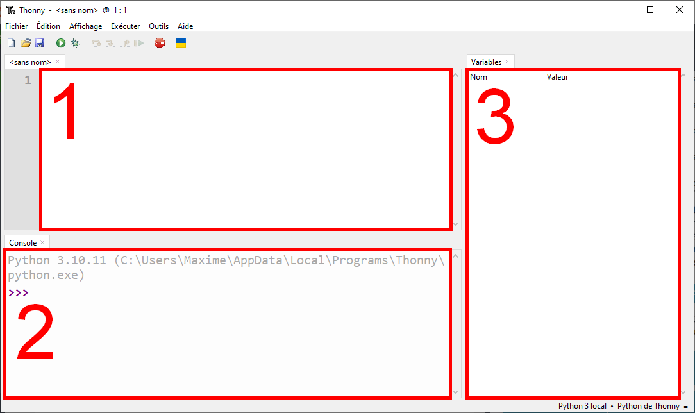

# Introduction

## Qu'est-ce que la programmation ?

Qu'est-ce que cela veut dire que *programmer* ? Pour répondre à cette
question, on peut revenir à l'origine du mot anglais désignant
l'ordinateur : *computer*. Ce mot est dérivé du verbe *to compute* qui,
en français, signifie littéralement *calculer*. Cela signifie qu'à
l'origine, un ordinateur était principalement une imposante machine
capable de rapidement effectuer une grande quantité de calculs les uns
après les autres. Ces calculs étaient rendus possibles par un composant
central de l'ordinateur : le processeur. Celui-ci était non seulement
capable d'effectuer les opérations d'une simple calculatrice, mais
pouvait également réaliser d'autres actions intéressantes. Dans les
grandes lignes, un processeur était capable de réaliser les opérations
suivantes :

-   Opérations arithmétiques : additions, soustractions,
    multiplications, divisions, etc.

-   Opérations de mémoire : enregistrer ou lire une valeur dans la
    mémoire de l'ordinateur

-   Opérations de comparaison : déterminer si deux valeurs sont égales,
    ou si l'une est plus petite ou plus grande que l'autre, puis
    effectuer une autre opération en fonction du résultat

-   Opérations logiques : ET, OU, NON, etc. (nous reviendrons sur leur
    signification plus tard)

Depuis cette époque où le processeur --- et donc l'ordinateur --- ne
pouvait exécuter que ces opérations très simples\... pas grand-chose n'a
changé ! Même si les processeurs modernes sont beaucoup plus rapides et
peuvent exécuter des opérations un peu plus complexes comme le calcul de
fonctions trigonométriques, le principe est resté le même. Ainsi, tous
les logiciels complexes que vous pouvez utiliser sur votre ordinateur
consistent en fait simplement en une séquence de ces simples opérations.
*Programmer* est donc l'art d'élaborer des séquences de ces instructions
simples, appelées *algorithmes*, dans le but de créer le programme
informatique que vous souhaitez. Ainsi, mis bouts à bouts, ces
instructions simples permettront tantôt de créer un jeu-vidéo, tantôt
d'imiter l'intelligence humaine.

## Comment écrit-on des algorithmes ?

À l'origine, les instructions que l'on voulait communiquer au processeur
devaient être écrites dans un *langage machine* en binaire.
Concrètement, les premier.ères informaticien.nes écrivaient leurs
algorithmes en perforant des cartes en papier où l'enchaînement de
certaines combinaisons de trous signifiait une instruction particulière.
Fort heureusement pour nous, la technologie a bien évolué depuis cette
époque et il existe maintenant des méthodes moins pénibles et plus
compréhensibles. En effet, afin d'éviter le langage machine et ainsi
d'écrire des algorithmes sous forme de 0 et de 1, une brillante
informaticienne a eu l'ingénieuse idée de créer un programme permettant
de traduire un langage assez naturel pour les humains en langage
machine. Ainsi, pour communiquer les instructions au processeur, on peut
aujourd'hui choisir entre une variété de *langages de programmation*.
Bien que chaque langage ait ses spécificités, ses points forts, et ses
points faibles, la plupart d'entre eux fonctionnent en suivant la même
logique. De ce fait, une fois que l'on a appris un premier langage de
programmation, il est relativement facile de transitionner vers les
autres. Dans ce cours, nous aborderons la programmation avec *Python*.
Ce langage a non seulement l'avantage d'être l'un des plus utilisés au
monde actuellement, mais est également bien adapté pour commencer la
programmation avec une syntaxe simple qui permet d'appréhender les
concepts fondamentaux sans trop s'attarder sur des détails.

## Que va-t-on apprendre à programmer avec Python ?

Théoriquement, n'importe quel programme peut être réalisé avec Python.
Toutefois, tout comme l'apprenti.e cuisinier.ère commence par apprendre
à couper des légumes avant de mijoter des plats élaborés, vous allez
également commencer par développer des programmes simples avant de vous
lancer dans le développement de programmes complexes. L'étape par
laquelle passent tou.te.s les apprenti.e.s informaticien.nes est la
création de *programmes consoles*. Il s'agit de programmes ne pouvant
pas afficher d'images ou utiliser la souris, mais affichant uniquement
du texte et pouvant interagir avec le clavier. Par exemple, la
description d'un programme que vous serez amenés à créer dans ce cours
est la suivante :

::: center
Un mini-jeu dans lequel le programme choisit un nombre aléatoire en 1 et
100. L'utilisateur doit ensuite deviner ce nombre en le moins de
tentatives possible. À chaque essai, le programme dira si le nombre
donné est correct, trop grand, ou trop petit.
:::

Lorsque ce jeu sera exécuté, et qu'un utilisateur y jouera, on pourra
voir le texte suivant à l'écran :

Comme vous pouvez le constater, ce genre de programme n'affiche que du
texte, et l'utilisateur ne peut interagir avec celui-ci qu'en écrivant
un nombre au clavier. Derrière ce programme assez simple en apparence se
cachent déjà toutefois de nombreux concepts de programmation importants.
Il est ainsi crucial de maîtriser ce genre de programmes consoles avant
d'aller plus loin. Une fois que vous aurez acquis des bases théoriques
et pratiques solides en programmation, vous pourrez alors vous lancer
dans un projet de développement d'un petit jeu vidéo en 2D.

## Installation et prise en main de Thonny

Pour débuter à programmer, vous aurez besoin d'un éditeur de texte, pour
écrire les instructions, ainsi que d'un interpréteur Python. Bien que
les deux logiciels puissent être installés indépendamment, il est plus
pratique d'installer un *Environnement de Développement Intégré* (*EDI*)
qui combine les deux et intègre d'autres fonctionnalités très pratiques.
Dans ce cours, nous utiliserons l'EDI *Thonny* qui est très bien adapté
pour commencer la programmation. Vous pouvez télécharger ce logiciel
pour Windows, Mac, et Linux depuis le site [thonny.org](https://thonny.org). Une
fois le logiciel installé, si celui-ci est en anglais et que vous
souhaitez changer la langue, vous pouvez le faire en cliquant sur
*Tools* $\rightarrow$ *Options\...* Puis en choisissant la langue
souhaitée dans le menu déroulant. Dans le menu *Affichage*, vous pouvez
activer l'option *Variables* et désactiver l'option *Assistant*. Votre
fenêtre devrait contenir les trois régions suivantes :

::: center

:::

1.  *Éditeur de code*. C'est dans cette fenêtre que vous écrirez votre
    code en Python.

2.  *Console*. C'est ici que vous verrez le texte de vos programmes,
    comme l'exemple du jeu du Devin.

3.  *Variables*. Cette zone permettra de consulter l'état des variables
    de votre programme (voir chapitre 2).

Pour tester que votre installation est fonctionnelle, vous allez pouvoir
écrire votre première ligne de code dans l'éditeur de code. Recopiez le
code suivant en faisant bien attention de respecter les minuscules sur
le mot `print`.

``` {code-block} python
:caption: Premier exemple de programme Python
print("Hello World !")
```

Vous pouvez ensuite cliquer sur le petit bouton vert avec un petit
triangle blanc (ou appuyer sur F5). Ceci aura pour effet d'exécuter
votre code. Si tout se passe normalement, vous devriez voir apparaître
le texte `Hello World !` dans la console. Ce n'est pas encore très
impressionnant, mais vous venez d'écrire et d'exécuter votre premier
programme !
