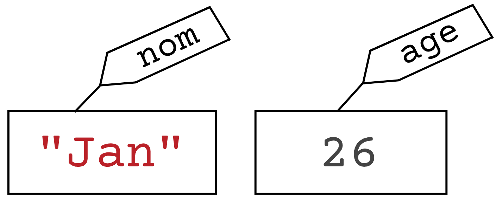

<!-- Copyright 2024 Maxime Jan <maxime.jan@edufr.ch> -->
<!-- SPDX-License-Identifier: CC-BY-NC-SA-4.0 -->

# Variables

## Qu'est-ce qu'une variable ?

Le premier concept fondamental que nous allons aborder en programmation est celui de *variables*. On peut décrire une variable comme étant une case mémoire de votre ordinateur possédant un nom et étant capable de stocker une valeur. De manière plus imagée. on peut visualiser une variable comme étant une boîte à chaussures contenant un objet et sur laquelle est collée une étiquette nommant son contenu. Une variable permet alors d'*enregistrer* des informations dans un programme.On peut par exemple imaginer un programme dans lequel le prénom et l'âge de l'utilisateur devraient être enregistrés. Ce programme devrait alors contenir deux variables qui peuvent être représentées comme ceci :





Nous avons ici en effet une boîte étiquetée *nom* contenant un nom de famille, et une boîte avec l'étiquette *age* contenant une valeur correspondante. Il est important de noter qu'une variable ne peut contenir qu'une seule valeur, et que, pour enregistrer deux informations différentes, il faut alors deux variables. En Python, on peut créer une variable en suivant la syntaxe suivante :

```{code-block} python
:caption: Format de déclaration d'une variable
nom_de_la_variable = valeur
```

Ainsi, en Python, on peut créer ces deux variables de la manière suivante :

```{code-block} python
:caption: Déclaration de 2 variables
nom = "Jan"
age = 32
```

Recopiez ce petit programme dans Thonny et exécutez-le. Vous devriez alors voir, dans la fenêtre *Variables*, que les deux variables ont été créées avec leur valeur correspondante. De cette manière, vous avez bien pu stocker deux valeurs dans la mémoire de l'ordinateur. En réalité, à la fin de l'exécution du programme, toutes les variables créées par le programme sont effacées. Ainsi, `nom` et `age` n'existent déjà plus, mais cette interface de Thonny vous permet encore de visualiser ce que le programme a fait.

## Types de valeur

Les deux variables que nous venons de créer ont chacune un type
différent. En effet, l'une contient du texte, alors que l'autre contient
un nombre entier. En Python, on distingue 4 types de données primitifs.

-   **`int`**. De son nom complet *integer*, le type `int` permet de représenter les *nombres entiers*. Par exemple : `1`, `2`, `3`, `999`, `-10`, ou `-376`.

-   `float`. Les flottants représentent les nombres réels. Par exemple : `3.14`, `4.5`, `-8.555`, ou `1000.001`. Attention, vous avez sûrement l'habitude en français d'appeler les réels des nombres à virgules. Pourtant, en Python, il ne faut pas mettre une virgule pour séparer les unités des décimales, mais bien un point.

-   `str`. Signifiant en anglais *string*, le type `str` permet de représenter des *chaînes de caractères*, ou, dit plus simplement, du texte. Les chaînes de caractères doivent toujours être entourées d'une paire de guillemets doubles ou simples. Par exemple : `"Bonjour"`, `’Ceci est une chaîne de caractères’`, ou `"QUOI ???"`.

-   `bool`. Le type booléen n'a que deux valeurs possibles : `True` et `False`. Ce type de valeur est utilisé lorsque l'information que vous souhaitez enregistrer ne peut avoir que deux états. Intuitivement, on peut utiliser le type `bool` lorsque cette information peut être vraie ou fausse (par exemple une variable `reponse` qui aurait la valeur `True` si la réponse à une question est vraie, et `False` sinon). Toutefois, n'importe quelle information à deux états peut être représentée de cette manière : c'est alors au programmeur de décider quel état est `True` et lequel est `False`. On peut s'imaginer une variable `etat_porte` qui est `True` lorsque la porte est ouverte, et qui est `False` quand la porte est fermée.


Le programme ci-dessous permet ainsi de créer des variables de chacun de ces types.

```{code-block} python
:caption: Déclaration d'une variable de chaque type
code_postal = 1700
latitude = 46.80237
ville = "Fribourg"
est_un_chef_lieu = True
```

## Ordre d'exécution des instructions

En programmation, l'ordre d'écriture des instructions est extrêmement important. En effet, que se passe-t-il lorsque l'on exécute le programme suivant :

```{code-block} python
autorisation = True
autorisation = False
```

À la fin de l'exécution de ce programme, vous pouvez constater, dans la fenêtre *Variables*, que la valeur de `autorisation` est `False`. Les instructions des programmes que vous écrivez sont en effet exécutées *séquentiellement*. C'est-à-dire que l'exécution du programme commence à la première ligne en haut et que chaque ligne est ensuite exécutée l'une après l'autre. Ainsi, dans l'exemple ci-dessus, la variable `autorisation` est d'abord initialisée à `True`, mais la ligne suivante modifie ensuite sa valeur. Cet exemple montre également que réutiliser plusieurs fois le même nom de variable ne crée pas une deuxième variable, mais permet de modifier sa valeur.

## Expressions

Pour le moment, nous avons assigné des valeurs littérales à nos variables. C'est-à-dire que nous avons directement écrit la valeur finale lui sera attribuée. Nous pouvons toutefois faire d'autres opérations plus intéressantes et assigner aux variables le résultat de calculs. En programmation, nous ne les appelons toutefois pas *calculs*, mais *expressions*. De plus, on ne dit pas que l'on *résout* une expression, mais on l'*évalue*. En Python, les opérateurs arithmétiques que l'on peut utiliser dans les expressions sont les suivants.

-   Opérateur d'addition +

    -   Entre deux `int` ou `float`, les deux nombres sont additionnés. Par exemple `10 + 6.15` est évalué à `16.15`.

    -   Entre deux `str`, les deux chaînes de caractères sont *concaténées*, c'est-à-dire qu'elles sont collées ensemble. Par exemple `"Bonjour" + "Au revoir"` est évalué à `"BonjourAu revoir"`.

-   Opérateur de soustraction - : soustrait un `int` ou un `float` à un autre. Par exemple, `99.9 - 10.9` est évalué à `89.0`.

-   Opérateur de multiplication

    -   Entre deux `int` ou `float`, les deux nombres sont multipliés. Par exemple, `2.5 * 4` est évalué à `10.0`.

    -   Entre un `str` et un `int` la chaîne de caractères est répétée autant de fois que le nombre donné. Par exemple, `"AB" * 3` est évalué à `"ABABAB"`.

-   Opérateur de division / : Divise un `int` ou un `float` par un autre. Par exemplte `5 / 2` est évalué à `2.5`.

-   Opérateur d'exponentiation ** : Elève un `int` ou `float` à la puissance d'un autre. Par exemple, `3 ** 3` est évalué à `27`.

-   Opérateur modulo % : donne le reste de la division entière entre deux `int` ou `float`. Ainsi `11 % 2` est évalué à 1, car la division entière de 11 par 2 donne 5 et il reste 1.

De plus, au lieu d'utiliser des valeurs littérales dans les expressions, on peut également utiliser des variables préalablement définies. Voici ci-dessous un exemple d'un programme Python utilisant plusieurs expressions. Sans l'exécuter sur Thonny et sans lire l'explication qui suit, essayez de réfléchir à son déroulement et à deviner le contenu de chaque variable à la fin de son exécution.

```{code-block} python
prix = 3 * 2 + 4
nombre = 12 - 2 ** 3 - 2
total = prix * nombre
nombre = nombre + 1
txt = "?" * nombre
```

## Tableau d'états

Pour comprendre le résultat du programme précédent, on peut utiliser un *tableau d'états*. Il s'agit d'un tableau où chaque colonne correspond à une variable et chaque ligne à l'état de la mémoire après chaque modification de variable. Celui-ci se construit étape par étape de la manière suivante :

````{admonition} Etape 0
:class: note dropdown
| prix | nombre | total | txt |
| :--- | :----- | :---- | :-- |
|      |        |       |     |
|      |        |       |     |
|      |        |       |     |
|      |        |       |     |
|      |        |       |     |

En inspectant rapidement le programme, on constate qu'il contient 4 variables différentes. Ainsi, le tableau initial contient ces 4 colonnes.
````

````{admonition} Etape 1
:class: note dropdown
| prix | nombre | total | txt |
| :--- | :----- | :---- | :-- |
| 10   |        |       |     |
|      |        |       |     |
|      |        |       |     |
|      |        |       |     |
|      |        |       |     |

 La première ligne du programme est exécutée. En respectant la priorité des opérations, l'expression est évaluée à `10`, et cette valeur est alors stockée dans la variable `prix`.
````

````{admonition} Etape 2
:class: note dropdown
| prix | nombre | total | txt |
| :--- | :----- | :---- | :-- |
| 10   |        |       |     |
| 10   | 2      |       |     |
|      |        |       |     |
|      |        |       |     |
|      |        |       |     |

À la 2ème ligne du programme, l'expression est évaluée à `2` et cette valeur est stockée dans la variable `nombre`. La valeur de `prix` n'ayant pas changé, celle-ci est également reportée sur cette ligne pour représenter l'état exact de la mémoire à ce point du programme.

````

````{admonition} Etape 3
:class: note dropdown
| prix | nombre | total | txt |
| :--- | :----- | :---- | :-- |
| 10   |        |       |     |
| 10   | 2      |       |     |
| 10   | 2      | 20    |     |
|      |        |       |     |
|      |        |       |     |   

Pour évaluer l'expression `prix * nombre`, il faut tout d'abord lire la valeur de ces variables. Ainsi, cette expression équivaut à `10 * 2` et la valeur `20` est alors enregistrée dans la variable `total`.
````                                      

````{admonition} Etape 4
:class: note dropdown
| prix | nombre | total | txt |
| :--- | :----- | :---- | :-- |
| 10   |        |       |     |
| 10   | 2      |       |     |
| 10   | 2      | 20    |     |
| 10   | 3      | 20    |     |
|      |        |       |     |

À la 4ème ligne du programme, il faut commencer par évaluer l'expression `nombre + 1`. En lisant la valeur de `nombre`, on constate qu'il s'agit de `2`. Ainsi, cette expression équivaut à `2 + 1` et s'évalue à `3`. Cette valeur est finalement stockée dans `nombre`. Attention, ce n'est **pas** parce que `nombre` a changé de valeur que celle de `total` doit être modifiée. En effet, la 3ème ligne a déjà été exécutée et ceci avec les valeurs en mémoire à ce moment-là. Des modifications de la mémoire n'impactent pas les instructions exécutées précédemment.
````

````{admonition} Etape 5
:class: note dropdown
| prix | nombre | total | txt |
| :--- | :----- | :---- | :-- |
| 10   |        |       |     |
| 10   | 2      |       |     |
| 10   | 2      | 20    |     |
| 10   | 3      | 20    |     |
| 10   | 3      | 20    | ??? |

 La valeur de `nombre` étant maintenant 3, l'expression de la 5ème ligne équivaut à `"?" * 3` et la valeur `"???"` est alors stockée dans `txt`.
````


Ainsi, le tableau d'état final après l'étape 5 nous permet de connaître avec certitude la valeur de chaque variable durant l'exécution de notre programme. Il s'agit d'un outil d'analyse très pratique, dont l'utilité sera multipliée lorsque de nouvelles structures de programmation seront introduites dans les prochains chapitres.

## Messages d'erreur

L'exemple précédent permet d'observer à nouveau l'importance de l'ordre d'exécution séquentiel des instructions. En particulier, on remarque qu'il est impératif qu'une variable soit d'abord créée avant d'être utilisée. Dans l'exemple précédent, cela signifie que `nombre` et `prix` doivent avoir été créés avant d'être utilisés dans l'expression `prix * nombre`. Si vous ne respectez pas cette règle, votre programme ne fonctionnera pas. Voici un exemple d'un programme erroné, avec le message d'erreur qui s'affiche lorsque l'on tente de l'exécuter.

```{code-block} python
:caption: Programme erroné
prix = 15
total = prix * nombre
nombre = 4
```

```{code-block} python
:caption: Message d'erreur
Fichier ".../variables.py", line 2, in <module>\\
     total = prix * nombre\\
NameError: name 'nombre' is not defined
```

Lorsque vous rencontrez des messages d'erreur, il faut absolument prendre le temps de les lire. En effet, même si ceux-ci peuvent paraître cryptiques à première vue, ils vous donnent de très précieuses informations sur ce qui ne fonctionne pas dans votre programme. Grâce au message d'erreur ci-dessus, on comprend que notre programme contient une erreur à la deuxième ligne. De plus, on voit que l'erreur est en rapport avec la variable `nombre`, car celle-ci n'a pas été définie. Cette erreur vient bien du fait que cette variable est utilisée dans une expression avant d'avoir été créée. Pour corriger ce bug, il faut donc inverser l'ordre des deux dernières lignes.\

Il est tout à fait normal, même pour un programmeur professionnel et expérimenté, d'écrire du code comportant des bugs. Ce qui distingue un bon d'un mauvais développeur est la capacité à corriger ces bugs en lisant les messages d'erreur. Ainsi, prenez bien le temps de les lire et de les comprendre à chaque fois que vous les rencontrez. Même s'ils vous paraissent compliqués au début, vous allez rapidement les apprivoiser et gagner en temps et en efficacité dans votre pratique de programmeur.

## Opérateurs d'affectation combinée

Lorsque l'on crée une variable, le signe d'égalité que l'on utilise est appelé *opérateur d'affectation*. Cet opérateur peut être utilisé non seulement lors de la création d'une variable, mais aussi, comme nous l'avons vu, pour modifier sa valeur plus tard. Dans l'exemple ci-dessous, on assigne la valeur `"Bonjour"` à la variable `salutations` et on lui ajoute la suite plus tard. De manière similaire, la variable `prix` est initialisée à `8.5` et sa valeur est doublée par la suite.

```{code-block} python
salutations = "Bonjour"
prix = 8.5
salutations = salutations + ",comment allez-vous ?"
prix = prix * 2
```

Ce genre d'instruction permettant de modifier la valeur de variables est très courant en programmation. De ce fait, même si ces lignes ne sont pas très compliquées, la flemmardise des programmeurs a donné naissance à une manière plus courte de les écrire en utilisant des *opérateurs d'affectation combinée*. Ceux-ci permettent de modifier la valeur d'une variable sans recopier son nom deux fois. Pour chaque point de la liste suivante, imaginons que nous avons une variable `n` contenant la valeur `10`.

-   Opérateur d'incrémentation += : Ajoute une valeur à la variable. Après avoir exécuté l'instruction`n += 5`, alors `n` contiendra la valeur `15`.

-   Opérateur de décrémentation -= : Retire une valeur à la variable. Après avoir exécuté l'instruction`n -= 3`, alors `n` contiendra la valeur `7`.

-   Opérateur = : Multiplie la variable par une valeur. Après avoir exécuté l'instruction `n *= 2`, alors `n` contiendra la valeur `20`.

-   Opérateur /= : Divise la variable par une valeur. Après avoir exécuté l'instruction `n /= 5`, alors `n` contiendra la valeur `2`.

-   Opérateur *= : Mets la variable à la puissance d'une valeur. Après avoir exécuté l'instruction`n **= 2`, alors `n` contiendra la valeur `100`.

-   Opérateur %= : Remplace le contenu de la variable par le reste de la division entière entre sa valeur et une autre. Après avoir exécuté l'instruction `n %= 3`, alors `n` contiendra la valeur `1`.

Ainsi, le précédent exemple peut se réécrire de la manière suivante

```{code-block} python
:caption: Programme revisité avec les opérateurs d'affectation combinés
salutations = "Bonjour"
prix = 8.5
salutations += ", comment allez-vous ?"
prix *= 2
```

## Exercices

### Exercice 1
Ce code Python déclare 5 variables, mais contient une erreur par ligne.
Trouvez ces erreurs et corrigez-les.

```{code-block} python
6 = age
message = Je suis absent
note = 4,5
porte_ouverte = false
nombre de voitures = 10
```

````{admonition} Solution
:class: note dropdown
```{code-block} python
age = 6
message = "Je suis absent"
note = 4.5
porte_ouverte = False
nombre_de_voitures = 10
```


1.  A la création d'une variable, le nom doit toujours être à gauche du signe égal, et la valeur à droite.

2.  Une valeur de type `str` doit être entourée de guillemets.

3.  Une valeur de type `float` s'écrit non pas avec une virgule mais avec un point.

4.  Une valeur de type `bool` prend une majuscule à `True` et `False`.

5.  Les noms de variables ne peuvent pas contenir d'espaces. Généralement, en Python, on les remplace alors par des tirets en bas.
````

### Exercice 2
Déterminez la valeur de chacune des variables de ce programme en créant un tableau d'états.

```{code-block} python
x = 10
y = 2
z = y * x
y = z + x
x = y - z / 2
z = z * 2
y = 5
```

````{admonition} Solution
:class: note dropdown
| x  | y  | z  |
| :--| :--| :--|
| 10 |    |    |
| 10 | 2  |    |
| 10 | 2  | 20 |
| 10 | 30 | 20 |
| 20 | 30 | 20 |
| 20 | 30 | 40 |
| 20 | 5  | 40 |

````

### Exercice 3
Déterminez la valeur de chacune des variables de ce programme en créant un tableau d'états.

```{code-block} python
nombre_habitants = 150 + 25 * 2
cout = 100
prix = nombre_habitant * cout
cout = cout / 2
nombre_habitants = nombre_habitants - 100
prix = prix + nombre_habitants * cout
nombre_habitants = 400
prix = prix + nombre_habitants * cout
```

````{admonition} Solution
:class: note dropdown
| nombre_habitants  | cout  | prix  |
| :--| :--| :--|
| 200 |    |    |
| 200 | 100  |    |
| 200 | 100  | 20000 |
| 200 | 50 | 20000 |
| 100 | 50 | 20000 |
| 100 | 50 | 25000 |
| 400 | 50  | 25000 |
| 400 | 50  | 45000 |

````

### Exercice 4
Complétez le programme ci-dessous de manière à ce qu'il permette de calculer la moyenne des notes principales dans la variable du même nom. La note de math est de 4 et demi, la note de français de 6 et la note d'allemand de 5 et demi.

```{code-block} python
math = 
francais = 
allemand = 
moyenne = 
```

````{admonition} Solution
:class: note dropdown
Ce programme permet de calculer la moyenne des notes de math, de français, et d'allemand. Cette moyenne est stockée dans la variable `x` et celle-ci pourrait alors être renommée en `moyenne` ou `moyenne_principale`.
````

### Exercice 5
Écrivez un petit programme en Python permettant de calculer le volume $V$ d'un cylindre en fonction de son rayon et de son hauteur. Votre programme contiendra les lignes suivantes :

-   Créer une variable `pi` contenant la valeur `3.14`.

-   Créer une variable `hauteur` contenant la valeur `30`

-   Créer une variable `rayon` contenant la moitié de 11

-   Créer une variable `aire_disque` contenant le résultat de
    $\pi \cdot r^2$

-   Créer une variable `volume` contenant le résultat de l'aire du
    disque multiplié par la hauteur.

Au terme de l'exécution de ce programme, la variable `volume` devrait
contenir la valeur `2849.55`


````{admonition} Solution
:class: note dropdown
```{code-block} python
pi = 3.14
hauteur = 30
rayon = 11 / 2 #ou rayon = 5.5
aire_disque = pi * rayon ** 2
volume = aire_disque * hauteur
```
````

### Exercice 6
Écrivez un programme Python contenant une variable `x` initialisée à 10.
Puis, complétez ce programme pour que celui-ci effectue les opérations
suivantes

-   Ajoute 3 à `x`

-   Retire 8 à `x`

-   Multiplie `x` par 10

-   Divise `x` par 5

-   Élève `x` à la puissance 3

A la fin de l'exécution de ce programme, la variable `x` devrait
contenir la valeur `1000`


````{admonition} Solution
:class: note dropdown
```{code-block} python
x = 10
x += 3
x -= 8
x *= 10
x /= 5
x **= 3
```
````

### Exercice 7 (difficile)
Lisez attentivement le programme ci-dessous et expliquez, en français, ce qu'il fait (vous n'avez pas besoin d'évaluer les expressions). Veillez à bien expliquer à quoi correspondent les variables `h1`, `h2`, et `total`.

```{code-block} python
CHF_par_h1 = 32.5
CHF_par_h2 = 40
heure_debut = 20
temps_de_travail = 8.5
h1 = (heure_debut + temps_de_travail)
h2 = temps_de_travail - h1
total = h1 * CHF_par_h1 + h2 * CHF_par_h2
```

````{admonition} Solution
:class: note dropdown
Ce programme permet de calculer et stocker le salaire d'un employé dans la variable `total`. De toute évidence, cet employé travail de nuit comme il a commencé à 20h et a travaillé durant 8 heures et demie. La variable `h1` contient le nombre d'heures passées après minuit (en effet, le reste de la division entière de 28.5 par 24 nous donne 4.5, et l'employé a bien fini de travailler à 4 heure et demie). Ainsi, en soustrayant `h1` aux nombres d'heures travaillées au total, `h2` contient le nombre d'heures travaillées avant minuit. Ces deux variables permettent de calculer le salaire total avec les taux corrects.
````


