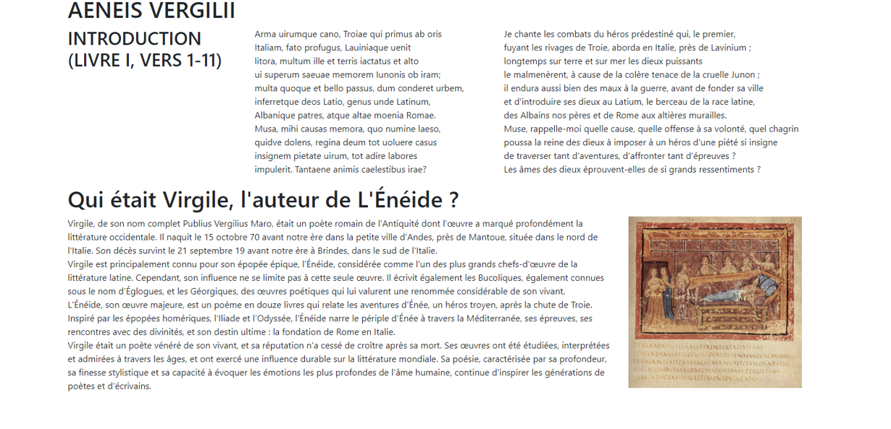

% SPDX-License-Identifier: CC-BY-NC-SA-4.0

```{role} html(code)
:language: html
```

# Bootstrap

## Qu'est-ce que Bootstrap ?
Bootstrap est un *framework* CSS open-source qui permet de créer facilement mettre en forme des applications web modernes, réactives et élégantes. Il a été développé initialement par Twitter et est désormais largement utilisé dans le développement web. Il permet notamment de simplifier la création de mises en page adaptatives grâce à son système de grille flexible et fluide. Cela garantit que les sites web s'affichent correctement sur une variété d'appareils, qu'il s'agisse de téléphones, de tablettes ou d'ordinateurs. Bootstrap propose également une collection riche de composants prédéfinis tels que des boutons, des barres de navigation, des fenêtres modales et des carrousels, permettant de gagner du temps lors du développement.

## Installer Bootstrap

Pour inclure Bootstrap sur votre site Web, il vous suffit d'ajouter des balises dans les fichiers HTML concernés.

1. Dans la balise `head`, ajoutez la balise `link` ci-dessous :

```{code} html
<link href="https://cdn.jsdelivr.net/npm/bootstrap@5.3.3/dist/css/bootstrap.min.css" rel="stylesheet" integrity="sha384-QWTKZyjpPEjISv5WaRU9OFeRpok6YctnYmDr5pNlyT2bRjXh0JMhjY6hW+ALEwIH" crossorigin="anonymous">
```

2. Juste avant la **fermeture** de la balise `body`, ajoutez la balise `script` ci-dessous 
```{code} html
<script src="https://cdn.jsdelivr.net/npm/bootstrap@5.3.3/dist/js/bootstrap.bundle.min.js" integrity="sha384-YvpcrYf0tY3lHB60NNkmXc5s9fDVZLESaAA55NDzOxhy9GkcIdslK1eN7N6jIeHz" crossorigin="anonymous"></script>
```

## La grille Bootstrap
Le système de grille de Bootstrap est comme une règle pour organiser le contenu sur une page web. Imaginez que chaque ligne est divisée en 12 cases égales, et vous pouvez décider combien de cases chaque élément de votre page doit occuper. Par exemple, un élément peut prendre 6 cases (la moitié de la ligne) et un autre peut en prendre les 6 restantes.

Ce système est conçu pour s’adapter automatiquement à la taille de l’écran. Sur un téléphone, les éléments peuvent s’empiler les uns sur les autres pour rester lisibles, tandis que sur un ordinateur, ils peuvent être alignés côte à côte. Cela permet de créer des pages web qui restent bien organisées et faciles à lire, peu importe l’appareil utilisé par vos visiteurs.

Pour commencer à utiliser la grille afin de disposer des éléments sur votre page, mettez tout le contenu de votre body dans une balise `div` contenant la classe `container`.

```{code} html
<body>
    <div class="container">
       ...
    </div>
</body>
```

Puis, groupez tous les éléments devant apparaître sur la même ligne dans une `div` ayant la classe `row`. Dans l'exemple ci-dessous, les éléments du site Web seraient disposés sur 3 lignes différentes.

```{code} html
<body>
    <div class="container">
        <div class="row">
            ...
        </div>

        <div class="row">
            ...
        </div>

        <div class="row">
            ...
        </div>
    </div>
</body>
```

Maintenant, au sein de chaque ligne, entourez chaque élément par une `div` ayant la classe `col` afin qu'ils apparaissent dans une colonne séparée. Un exemple complet est donné ci-dessous.

```{code} html
<body>
    <div class="container">
        <div class="row">
            <div class = "col">
                <p>Un premier paragraphe sur une 1ère colonne</p>
            </div>

            <div class = "col">
                <p>Un 2ème paragraphe sur une 2ème colonne</p>
            </div>

            <div class = "col">
                <h2>Un titre sur la 3ème colonne</h2>
            </div>
        </div>

        <div class="row">
            <div class = "col">
                <h1>La 1ère de 2 colonnes</h1>
            </div>

            <div class = "col">
                <h1>La 2ème de 2 colonnes</h1>
            </div>
            
        </div>

        <div class="row">
            <div class="col">
                <p>Sur cette ligne il n'y a qu'une colonne</p>
            </div>
        </div>
    </div>
</body>
```

### Exercice
Téléchargez le fichier [`exo_bootstrap.html`](exo_bootstrap.html), et modifiez-le de manière qu'il ressemble à l'image ci-dessous.



