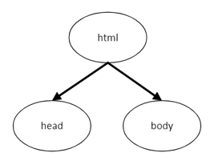
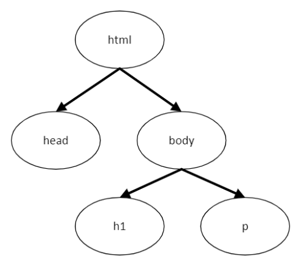
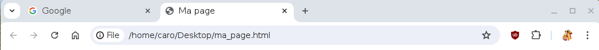

% Copyright 2024 Caroline Blank <caro@c-space.org>
% SPDX-License-Identifier: CC-BY-NC-SA-4.0

```{role} html(code)
:language: html
```

# HTML

Le format **HTML** (**H**yper**T**ext **M**arkup **L**anguage) est un format qui
permet de décrire le contenu et la structure d'une page Web. HTML n'est pas un
langage de programmation, il ne contient ni fonction, ni boucle, ni instruction
conditionnelle, mais c'est un ensemble de balises qui permettent de mettre un
document en page, afin que le navigateur puisse l'afficher correctement.

Les balises ont la forme suivante:

```{code} html
<h1>Bienvenue sur notre site Web</h1>
```

`<h1>` est une balise ouvrante et `</h1>` est une balise fermante. À chaque
balise ouvrante correspond une balise fermante à l'exception des balises qui
n'ont pas de contenu.

## Balise `<!DOCTYPE html>`

Tout document qui décrit une page Web doit débuter par:

```{code} html
<!DOCTYPE html>
```

Ce n'est pas une balise HTML, mais une information qui permet au navigateur de
savoir le type de document.

## Balise `<html>`

Tout le code HTML doit être inséré dans une balise nommée html:
`<html> ... </html>`.
La balise html contient en général deux autres balises:
- `<head> ... </head>`: entête du document, elle contient différentes
  informations concernant le document (titre de la page, type d'encodage, lien
  vers le fichier CSS, etc.). Ces informations ne seront pas affichées à l'écran
  à l'exception du titre affiché sur l'onglet de la page.
- `<body> ... </body>`: contient le contenu (corps) de la page. Tout ce qui sera
  dans cette partie sera affiché.

```{sidebar}

```

```{code} html
:number-lines:
<!DOCTYPE html>
<html>
  <head>
    ...
  </head>
  <body>
    ...
  </body>
</html>
```

## Balise `<body>`

La balise `<body>` contient tout le contenu visible de la page. C'est dans cette
partie que nous allons structurer le contenu à l'aide de différentes balises.

```{sidebar}

```

```{code} html
:number-lines:
<!DOCTYPE html>
<html>
  <head> ... </head>
  <body>
    <h1>Titre principal</h1>
    <p>Vous êtes dans le corps de la page HTML.</p>
  </body>
</html>
```

## Balises `<h1>` à `<h6>`

Les balises `<h1>` à `<h6>` permettent de définir des **titres** de différents
niveaux. `<h1>` est le titre le plus important (le plus grand) et `<h6>` le
moins important (le plus petit). Ces balises servent à organiser le contenu de
manière hiérarchique, comme les chapitres et sous-chapitres d'un livre.

- `<h1> ... </h1>`: titre principal (un seul par page en général)
- `<h2> ... </h2>`: sous-titre
- `<h3> ... </h3>`: sous-sous-titre
- `<h4> ... </h4>` à `<h6> ... </h6>`: niveaux de titres supplémentaires

```{code} html
:number-lines:
<h1>Titre principal</h1>
<h2>Sous-titre</h2>
<h3>Sous-sous-titre</h3>
```

Il est important de respecter la hiérarchie des titres : ne pas passer
directement d'un `<h1>` à un `<h4>` sans utiliser `<h2>` et `<h3>` entre les
deux.

## Balise `<p>`

La balise `<p>` permet de définir un **paragraphe** de texte. Le navigateur
ajoute automatiquement un espace avant et après chaque paragraphe pour aérer
le contenu.

```{code} html
:number-lines:
<p>Ceci est un premier paragraphe. Le navigateur va
automatiquement ajouter un espace après ce paragraphe.</p>
<p>Ceci est un deuxième paragraphe.</p>
```

Attention : les retours à la ligne dans le code HTML ne créent **pas** de
retours à la ligne à l'affichage. Le texte d'un paragraphe s'affiche en
continu. Pour forcer un saut de ligne, il faut utiliser la balise `<br>`.

## Balise `<head>`

La balise `<head>` contient différentes informations sur le document, notamment
le titre de la page et le type d'encodage.

## Balise `<title>`

La balise `<title>` permet de définir le titre de la page qui s'affichera sur
l'onglet du navigateur web.

```{code} html
<title>Ma page</title>
```



## Balise `<meta>`

La balise `<meta>` permet d'indiquer le type d'encodage (ASCII, UTF-8). Nous
souhaitons que les accents s'écrivent correctement sur notre page, nous allons
donc utiliser de l'UTF-8 que nous allons indiquer dans l'attribut charset:

```{code} html
<meta charset="utf-8">
```

Comme cette balise ne contient pas de contenu, c'est une balise unique (pas de
balise ouvrante et fermante).


(hyperliens)=
## Balise `<a>`

La balise `<a>` permet de créer un  **hyperlien**, c'est-à-dire un texte sur lequel
il faut cliquer pour accéder à une autre page. Il faut indiquer le lien dans
l'attribut href: {html}`<a href="lien">Texte</a>`

```{code} html
:number-lines:
<p>
  Pour accéder au site du collège,
  cliquez <a href="https://www.cscfr.ch/index.php/fr/">ici</a>
</p>
```

Pour ouvrir la nouvelle page dans un nouvel onglet, il faut ajouter l'attribut
`target` avec la valeur `_blank`:

```{code} html
<a href="lien" target="_blank">Texte</a>
```

[Tuto](https://developer.mozilla.org/fr/docs/Web/HTML/Element/a) élément `<a>`.

(listes)=
## Balises `<ul> <ol> <li>` 

Il existe deux types de listes:

1.  Listes numérotées (ordered) `<ol>`
    ```{code} html
    :number-lines:
    <ol>
      <li>Mettre 1L d'eau dans une casserole</li>
      <li>Porter à ébullition</li>
      ...
    </ol>
    ```
2.  Listes à puces (unordered) `<ul>`
    ```{code} html
    :number-lines:
    <ul>
      <li>Tomates</li>
      <li>Courgettes</li>
      ...
    </ul>
    ```

[Tuto](https://developer.mozilla.org/fr/docs/Web/HTML/Element/li) listes.

(images)=
## Balise ``

La balise `` permet d'insérer une image sur une page Web. Dans l'attribut
`src` (abréviation pour source), il faut indiquer le lien vers l'image, soit une
URL, soit le chemin local.

- {html}`` (dans le même répertoire)
- {html}`` (dans un sous-répertoire)

Cette balise peut contenir aussi les attributs height ou width qui permettent de
déterminer la hauteur et/ou la largeur de l'image en pixels.

```{code} html

```

[Tuto](https://developer.mozilla.org/fr/docs/Learn/HTML/Multimedia_and_embedding/Images_in_HTML)
images.

## Balise `<br>`

La balise `<br>` permet de faire un saut de ligne (break). Comme cette balise ne
contient pas de contenu, c'est une balise unique (pas de balise ouvrante et
fermante).

```{code} html
À la fin de cette ligne, il y aura un saut de ligne. <br>
```

## Balise `<table>`

La balise `<table>` permet de représenter des tableaux de données (tableaux en
  deux dimensions). Les tableaux peuvent aussi être utilisés pour la mise en
  page, par exemple mettre du texte à côté d'une image ou mettre plusieurs
  images l'une à côté de l'autre.

```{code} html
:number-lines:
<table>
  <tr>                        <!-- Première ligne -->
    <th>Ingrédients</th>      <!-- entête première colonne -->
    <th>Quantité</th>         <!-- entête deuxième colonne -->
  </tr>
  <tr>                        <!-- Deuxième ligne -->
    <td>Pommes de terre</td>  <!-- Première colonne -->
    <td>1 kg</td>             <!-- Deuxième colonne -->
  </tr>
  <tr>
    <td>lait</td>
    <td>0.5l</td>
  </tr>
</table>
```
 
[Tuto](https://developer.mozilla.org/fr/docs/Web/HTML/Element/table) tables et
tableaux


## Exercice {num2}`exercice`

Notez la balise qui indique:

```{role} input(quiz-input)
:right: width: 12rem;
:check: json trim
```

```{quiz}
:style: max-width: 42rem;
1.  {input}`{"<html>": true}`
    ... le début de la partie HTML?
2.  {input}`{"</h1>": true}`
    ... la fin d'un titre principal?
3.  {input}`{"<head>": true}`
    ... le début de l'entête du document?
4.  {input}`{"</body>": true}`
    ... la fin du contenu (corps) de la page?
5.  {input}`{"<h2>": true}`
    ... le début d'un titre de niveau 2?
6.  {input}`{"</p>": true}`
    ... la fin d'un paragraphe?
7.  {input}`{"<title>": true}`
    ... le début du titre de la page indiqué dans l'onglet?
```

## Exercice {num2}`exercice`

Dans quelle partie les balises suivantes se trouvent-elles?

```{role} input(quiz-input)
:right: width: 6rem;
:check: json trim
```

```{role} choix(quiz-select)
:right:
:options: |
: <html></html>
: <head></head>
: <body></body>
```

```{quiz}
:style: max-width: 28rem;
1.  {choix}`<body></body>`
    `<p>...</p>`
2.  {choix}`<head></head>`
    `<meta charset="utf-8">`
3.  {choix}`<html></html>`
    `<head>...</head>`
4.  {choix}`<body></body>`
    `<h2>...</h2>`
5.  {choix}`<html></html>`
    `<body>...</body>`
6.  {choix}`<body></body>`
    `<h1>...</h1>`
7.  {choix}`<head></head>`
    `<title>...</title>`
8.  {choix}`<body></body>`
    `<h4>...</h4>`
```


## Exercice {num2}`exercice`

En utilisant l'éditeur ci-dessous, complétez le `<body>` pour créer une page HTML contenant :

1. Un titre principal `<h1>` avec le texte "Ma page"
2. Un paragraphe `<p>` avec une phrase de votre choix
3. Un sous-titre `<h2>` avec le texte "Section 1"
4. Un deuxième paragraphe `<p>`
5. Un sous-sous-titre `<h3>` avec le texte "Détails"
6. Un troisième paragraphe `<p>`

Observez la différence de taille entre les niveaux de titres.

```{exec} html
:editor: 7a1b2c3d-4e5f-6a7b-8c9d-0e1f2a3b4c5d
:style: height: 14rem;
<!DOCTYPE html>
<html>
  <head>
    <meta charset="utf-8">
    <title>Ma page</title>
  </head>
  <body>
    <h1>Titre</h1>
  </body>
</html>
```

````{solution}
```{exec} html
:when: load
:editor:
:style: height: 14rem;
<!DOCTYPE html>
<html>
  <head>
    <meta charset="utf-8">
    <title>Ma page</title>
  </head>
  <body>
    <h1>Ma page</h1>
    <p>Bienvenue sur ma première page HTML.</p>
    <h2>Section 1</h2>
    <p>Voici le contenu de la première section.</p>
    <h3>Détails</h3>
    <p>Voici quelques détails supplémentaires.</p>
  </body>
</html>
```
````

## Exercice {num2}`exercice`

En utilisant l'éditeur ci-dessous, ajoutez dans le `<body>` :

1. Un paragraphe contenant un lien vers `https://fr.wikipedia.org` avec le texte "Wikipédia"
2. Un deuxième lien, cette fois qui s'ouvre dans un **nouvel onglet** (attribut `target`), vers un site de votre choix

```{exec} html
:editor: 8b2c3d4e-5f6a-7b8c-9d0e-1f2a3b4c5d6e
:style: height: 14rem;
<!DOCTYPE html>
<html>
  <head>
    <meta charset="utf-8">
    <title>Liens</title>
  </head>
  <body>
    <p>Visitez <a href="">...</a></p>
  </body>
</html>
```

````{solution}
```{exec} html
:when: load
:editor:
:style: height: 14rem;
<!DOCTYPE html>
<html>
  <head>
    <meta charset="utf-8">
    <title>Liens</title>
  </head>
  <body>
    <p>Visitez <a href="https://fr.wikipedia.org">Wikipédia</a></p>
    <p>Découvrez <a href="https://www.youtube.com" target="_blank">YouTube</a> (s'ouvre dans un nouvel onglet)</p>
  </body>
</html>
```
````

## Exercice {num2}`exercice`

En utilisant l'éditeur ci-dessous, ajoutez dans le `<body>` :

1. Une liste **à puces** `<ul>` de vos 3 plats préférés
2. En dessous, une liste **numérotée** `<ol>` des étapes pour préparer un de ces plats (au moins 3 étapes)

```{exec} html
:editor: 9c3d4e5f-6a7b-8c9d-0e1f-2a3b4c5d6e7f
:style: height: 14rem;
<!DOCTYPE html>
<html>
  <head>
    <meta charset="utf-8">
    <title>Listes</title>
  </head>
  <body>
    <h2>Mes plats préférés</h2>
  </body>
</html>
```

````{solution}
```{exec} html
:when: load
:editor:
:style: height: 18rem;
<!DOCTYPE html>
<html>
  <head>
    <meta charset="utf-8">
    <title>Listes</title>
  </head>
  <body>
    <h2>Mes plats préférés</h2>
    <ul>
      <li>Pizza</li>
      <li>Lasagnes</li>
      <li>Fondue</li>
    </ul>
    <h2>Recette de la pizza</h2>
    <ol>
      <li>Préparer la pâte</li>
      <li>Étaler la sauce tomate</li>
      <li>Ajouter la mozzarella</li>
      <li>Cuire au four à 220°C pendant 12 minutes</li>
    </ol>
  </body>
</html>
```
````

## Exercice {num2}`exercice`

En utilisant l'éditeur ci-dessous, ajoutez dans le `<body>` :

1. Une image en utilisant l'URL suivante dans l'attribut `src` :
   `https://picsum.photos/300/200`
2. Ajustez sa largeur à 200 pixels avec l'attribut `width`
3. Ajoutez un paragraphe en dessous de l'image avec la légende "Une image aléatoire"

```{exec} html
:editor: ad4e5f6a-7b8c-9d0e-1f2a-3b4c5d6e7f8a
:style: height: 14rem;
<!DOCTYPE html>
<html>
  <head>
    <meta charset="utf-8">
    <title>Images</title>
  </head>
  <body>
    
  </body>
</html>
```

````{solution}
```{exec} html
:when: load
:editor:
:style: height: 14rem;
<!DOCTYPE html>
<html>
  <head>
    <meta charset="utf-8">
    <title>Images</title>
  </head>
  <body>
    
    <p>Une image aléatoire</p>
  </body>
</html>
```
````

## Exercice {num2}`exercice`

En utilisant l'éditeur ci-dessous, complétez le tableau pour représenter votre horaire du lundi et mardi matin (3 heures de cours). Ajoutez :

- Trois lignes de données (`<td>`) avec les heures et les cours

```{exec} html
:editor: be5f6a7b-8c9d-0e1f-2a3b-4c5d6e7f8a9b
:style: height: 18rem;
<!DOCTYPE html>
<html>
  <head>
    <meta charset="utf-8">
    <title>Tableaux</title>
  </head>
  <body>
    <table border="1">
      <tr>
        <th>Heures</th>
        <th>Lundi</th>
        <th>Mardi</th>
      </tr>
    </table>
  </body>
</html>
```

````{solution}
```{exec} html
:when: load
:editor:
:style: height: 20rem;
<!DOCTYPE html>
<html>
  <head>
    <meta charset="utf-8">
    <title>Tableaux</title>
  </head>
  <body>
    <table border="1">
      <tr>
        <th>Heures</th>
        <th>Lundi</th>
        <th>Mardi</th>
      </tr>
      <tr>
        <td>08:05-08:50</td>
        <td>Français</td>
        <td>Maths</td>
      </tr>
      <tr>
        <td>08:55-09:40</td>
        <td>Allemand</td>
        <td>Informatique</td>
      </tr>
      <tr>
        <td>09:45-10:30</td>
        <td>Anglais</td>
        <td>Histoire</td>
      </tr>
    </table>
  </body>
</html>
```
````
