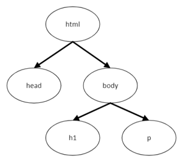

% Copyright 2024 Caroline Blank <caro@c-space.org>
% SPDX-License-Identifier: CC-BY-NC-SA-4.0

```{role} html(code)
:language: html
```

# HTML

Le premier type de fichier permettant de décrire une page Web est le **HTML** (**H**yper**T**ext **M**arkup **L**anguage). Les fichiers de ce type permettent de décrire le contenu et la structure d'une page Web.

Attention, HTML n'est pas un langage de programmation comme Python ! Il ne permet donc pas de créer des programmes, mais simplement de décrire les textes, images, vidéos à afficher sur la page Web et à les organiser.

Le langage HTML fonctionne avec un principe de balises. Une balise a la forme suivante :

```{code} html
<h1>Bienvenue sur notre site Web</h1>
```

`<h1>` est une balise ouvrante et `</h1>` est une balise fermante. Le texte entre les deux correspondant au contenu de cette balise. À chaque
balise ouvrante correspond donc une balise fermante, à l'exception des balises qui n'ont pas de contenu.

## `<!DOCTYPE html>`

Tout document qui décrit une page Web doit débuter par une sorte de balise un peu spéciale:

```{code} html
<!DOCTYPE html>
```

Ce n'est pas une balise HTML, mais une information qui permet au navigateur de quel type de document il s'agit.

## Balise `<html>`

Tout le code HTML doit être inséré dans une balise nommée html:
`<html> ... </html>`.
La balise html contient en général deux autres balises:
- `<head> ... </head>`: entête du document, elle contient différentes
  informations concernant le document (titre de la page, type d'encodage, lien
  vers le fichier CSS, etc.). Ces informations ne seront pas affichées à l'écran
  à l'exception du titre affiché sur l'onglet de la page.
- `<body> ... </body>`: contient le contenu (corps) de la page. Tout ce qui sera
  dans cette partie sera affiché.

```{sidebar}

```

```{code} html
:number-lines:
<!DOCTYPE html>
<html>
  <head>
    ...
  </head>
  <body>
    ...
  </body>
</html>
```

## Balise `<body>`

Dans la balise `<body>`, nous allons structurer le contenu de la page. Nous
allons voir les balises les plus simples qui permettent de définir des titres,
sous-titres et paragraphes:
- `<h1> ... </h1>`: permet de définir un titre principal
- `<h2> ... </h2>`: permet de définir un sous-titre
- `<h3> ... </h3>`: permet de définir un sous-sous-titre
- `<h...> ... </h...>`: permet de définir un sous-...-sous-titre
- `<p> ... </p>`: permet de définir un paragraphe

```{sidebar}

```

```{code} html
:number-lines:
<!DOCTYPE html>
<html>
  <head> ... </head>
  <body>
    <h1>Titre principal</h1>
    <p>Vous êtes dans le corps de la page HTML.</p>
  </body>
</html>
```

## Balise `<head>`

La balise `<head>` contient différentes informations sur le document, notamment
le titre de la page et le type d'encodage.

## Balise `<title>`

La balise `<title>` permet de définir le titre de la page qui s'affichera sur
l'onglet du navigateur web.

```{code} html
<title>Ma page</title>
```


## Balise `<meta>`

La balise `<meta>` permet d'indiquer le type d'encodage (ASCII, UTF-8). Nous
souhaitons que les accents s'écrivent correctement sur notre page, nous allons
donc utiliser de l'UTF-8 que nous allons indiquer dans l'attribut charset:

```{code} html
<meta charset="utf-8">
```

Comme cette balise ne contient pas de contenu, c'est une balise unique (pas de
balise ouvrante et fermante).

## Exercice 1

But: Comprendre la structure principale d'un document HTML.

```{iframe} https://learningapps.org/watch?v=pxjjqttb224
:style: height: 530px
```

(hyperliens)=
## Hyperliens

La balise `<a>` permet de créer un  hyperlien, c'est-à-dire un texte sur lequel
il faut cliquer pour accéder à une autre page. Il faut indiquer le lien dans
l'attribut href: {html}`<a href="lien">Texte</a>`

```{code} html
:number-lines:
<p>
  Pour accéder au site du collège,
  cliquez <a href="https://www.cscfr.ch/index.php/fr/">ici</a>
</p>
```

Pour ouvrir la nouvelle page dans un nouvel onglet, il faut ajouter l'attribut
`target` avec la valeur `_blank`:

```{code} html
<a href="lien" target="_blank">Texte</a>
```

[Tuto](https://developer.mozilla.org/fr/docs/Web/HTML/Element/a) élément `<a>`.

(listes)=
## Listes

Il existe deux types de listes:

1.  Listes numérotées (ordered) `<ol>`
    ```{code} html
    :number-lines:
    <ol>
      <li>Mettre 1L d'eau dans un casserole</li>
      <li>Porter à ébullition</li>
      ...
    </ol>
    ```
2.  Listes à puces (unordered) `<ul>`
    ```{code} html
    :number-lines:
    <ul>
      <li>Tomates</li>
      <li>Courgettes</li>
      ...
    </ul>
    ```

[Tuto](https://developer.mozilla.org/fr/docs/Web/HTML/Element/li) listes.

(images)=
## Images

La balise `` permet d'insérer une image sur une page Web. Dans l'attribut
`src`, il faut indiquer le lien vers l'image, soit une URL, soit le chemin
local.

- {html}`` (dans le même répertoire)
- {html}`` (dans un sous-répertoire)

Cette balise peut contenir aussi les attributs height ou width qui permettent de
déterminer la hauteur et/ou la largeur de l'image en pixels.

```{code} html

```

[Tuto](https://developer.mozilla.org/fr/docs/Learn/HTML/Multimedia_and_embedding/Images_in_HTML)
images.

## Sauts de ligne

La balise `<br>` permet de faire un saut de ligne (break). Comme cette balise ne
contient pas de contenu, c'est une balise unique (pas de balise ouvrante et
fermante).

```{code} html
À la fin de cette ligne, il y aura un saut de ligne. <br>
```

## Tables ou tableaux

La balise `<table>` permet de représenter des tableaux de données (tableaux en
  deux dimensions). Les tableaux peuvent aussi être utilisés pour la mise en
  page, par exemple mettre du texte à côté d'une image ou mettre plusieurs
  images l'une à côté de l'autre.

```{code} html
:number-lines:
<table>
  <tr>                        <!-- Première ligne -->
    <th>Ingrédients</th>      <!-- entête première colonne -->
    <th>Quantité</th>         <!-- entête deuxième colonne -->
  </tr>
  <tr>                        <!-- Deuxième ligne -->
    <td>Pommes de terre</td>  <!-- Première colonne -->
    <td>1 kg</td>             <!-- Deuxième colonne -->
  </tr>
  <tr>
    <td>lait</td>
    <td>0.5l</td>
  </tr>
</table>
```

[Tuto](https://developer.mozilla.org/fr/docs/Web/HTML/Element/table) tables et
tableaux

## Exercice 2

But: Ouvrir un document HTML sur Visual Studio Code.

[Installation de Visual Studio Code](../../Software/vscode.md)

1. Sur OneDrive, dans le dossier `Informatique/HTML-CSS`, créer un dossier `exercices`.
2. Télécharger le fichier [`index.html`](index.html) et le sauvegarder sur
   OneDrive dans le dossier créé en 1.
3. Ouvrir VSCode.
4. Dans VSCode choisir "Ouvrir le dossier..."" et sélectionner le dossier
   `Informatique/HTML-CSS/exercices` de votre OneDrive.
   ```{figure} images/ouvrir.png
   :alt: Ouvrir le dossier
   :width: 50%
   :align: center
   ```
5. Sélectionner le fichier `index.html` et le code HTML s'affiche.
6. Pour voir le rendu, double-cliquer sur le fichier `index.html` de votre
   OneDrive, le fichier s'ouvrira dans le navigateur.

## Exercice 3

But: Comprendre un document HTML simple et le modifier.\
Vous voyez maintenant le code HTML et ce que la page affiche.

1. Qu'est-ce que vous comprenez de cette page?
2. Vous allez maintenant modifier cette page. Pour valider une modification:
    - Sauvegarder le document dans VSCode ({kbd}`ctrl` + {kbd}`s` ou
      {kbd}`command` + {kbd}`s`).
    - Actualiser la page du navigateur (appuyer sur {kbd}`F5`).
      ```{figure} images/actualiser.png
      :alt: Actualiser la page
      :width: 30%
      :align: center
      ```
3. Modifier le titre et le premier paragraphe pour remplacer "Collège du Sud"
   par "Collège Sainte-Croix".
4. Modifier la partie présentation pour avoir les informations qui
   correspondent au Collège Sainte-Croix. Changer aussi le lien vers le site de
   l'école. (cf. [](#hyperliens))
5. Compléter la liste de vos cours avec: Économie et droit, Biologie, ...
6. Changer la liste de vos cours par une liste numérotée. (cf. [](#listes))
7. Ajouter un sous-titre "Ma classe" et un paragraphe avec quelques
   informations.
8. Ajouter une image du Collège Sainte-Croix:
    - Créer un dossier `images` en cliquant sur l'icone "Nouveau dossier".
      ```{figure} images/dossier.png
      :alt: Nouveau dossier
      :width: 40%
      :align: center
      ```
    - Télécharger l'image que vous avez choisie et la sauvegarder dans le
      dossier `images`.
    - Noter le code HTML nécessaire. (cf. [](#images))
    - Ne pas oublier d'indiquer la source.
9. Faire un tableau de votre horaire.