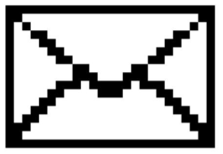
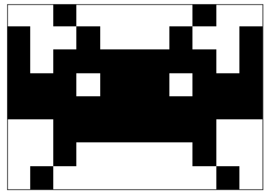
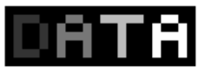
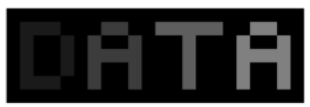
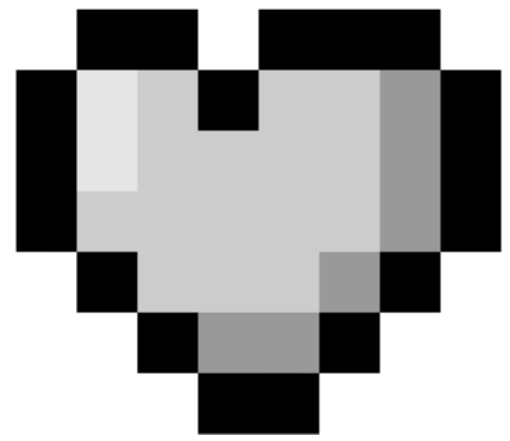
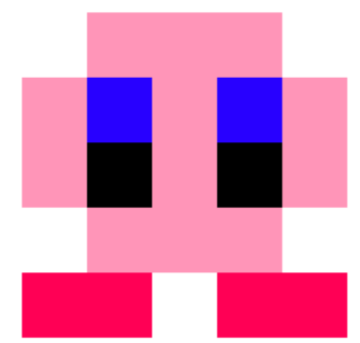

# Représentation des images


## Exercices

### Editeur de fichiers PBM, PGM, PPM
<link rel="stylesheet" href="https://cdn.jsdelivr.net/npm/bootstrap@4.3.1/dist/css/bootstrap.min.css"
        integrity="sha384-ggOyR0iXCbMQv3Xipma34MD+dH/1fQ784/j6cY/iJTQUOhcWr7x9JvoRxT2MZw1T" crossorigin="anonymous">
<div class="container">

<div class="row justify-content-center">
<div class="col-md-10 text-center">
<textarea id="dataEntry" style="font-family: 'Courier New', Courier, monospace;" class="form-control" rows="14" cols="80">P1
36 11
1 0 0 0 1 0 0 1 1 1 1 1 0 0 1 0 0 0 0 0 0 1 0 0 0 0 0 0 1 1 1 1 1 0 0 1
1 0 0 0 1 0 0 1 0 0 0 0 0 0 1 0 0 0 0 0 0 1 0 0 0 0 0 0 1 0 0 0 1 0 0 1
1 0 0 0 1 0 0 1 0 0 0 0 0 0 1 0 0 0 0 0 0 1 0 0 0 0 0 0 1 0 0 0 1 0 0 1
1 0 0 0 1 0 0 1 0 0 0 0 0 0 1 0 0 0 0 0 0 1 0 0 0 0 0 0 1 0 0 0 1 0 0 1
1 0 0 0 1 0 0 1 0 0 0 0 0 0 1 0 0 0 0 0 0 1 0 0 0 0 0 0 1 0 0 0 1 0 0 1
1 1 1 1 1 0 0 1 1 1 1 1 0 0 1 0 0 0 0 0 0 1 0 0 0 0 0 0 1 0 0 0 1 0 0 1
1 0 0 0 1 0 0 1 0 0 0 0 0 0 1 0 0 0 0 0 0 1 0 0 0 0 0 0 1 0 0 0 1 0 0 1
1 0 0 0 1 0 0 1 0 0 0 0 0 0 1 0 0 0 0 0 0 1 0 0 0 0 0 0 1 0 0 0 1 0 0 0
1 0 0 0 1 0 0 1 0 0 0 0 0 0 1 0 0 0 0 0 0 1 0 0 0 0 0 0 1 0 0 0 1 0 0 0
1 0 0 0 1 0 0 1 0 0 0 0 0 0 1 0 0 0 0 0 0 1 0 0 0 0 0 0 1 0 0 0 1 0 0 1
1 0 0 0 1 0 0 1 1 1 1 1 0 0 1 1 1 1 1 0 0 1 1 1 1 1 0 0 1 1 1 1 1 0 0 1</textarea>
</div>
</div>
<div class="row justify-content-center mt-5">
    <div class="col-md-8 text-center">
        <p id="sha256"></p>
    </div>
</div>
<div class="row justify-content-center mb-4 mt-4">
<div class="col-md-8 text-center">
<button id="dataEntryBtn" class="btn btn-primary">Générer l'image</button>
</div>
</div>
<div class="row justify-content-center">
<div class="col-md-8 text-center">
<canvas id="canvas2" style="image-rendering:pixelated;"></canvas>
</div>
</div>
</div>


### Exercice 1 
Le code binaire ci-dessous est censé représenter l'image d'enveloppe suivante.


Toutefois, l'entête de ce code binaire permettant de générer l'image au format .pbm est manquant ! Copiez/collez le code binaire dans l'éditeur ci-dessus et compléter l'entête pour que l'image se génère correctement

```{code-block} text
1 1 1 1 1 1 1 1 1 1 1 1 1 1 1 1 1 1 1 1 1 1 1 1 1 1 1 0 0 0 0 0 0 0 0 0 0 0 0 0 0 0 0 0 0 0 0 0 1 1 1 0 1 0 0 0 0 0 0 0 0 0 0 0 0 0 0 0 0 0 0 0 1 0 1 1 0 0 1 1 0 0 0 0 0 0 0 0 0 0 0 0 0 0 0 1 1 0 0 1 1 0 0 0 1 1 0 0 0 0 0 0 0 0 0 0 0 0 0 1 1 0 0 0 1 1 0 0 0 0 1 1 0 0 0 0 0 0 0 0 0 0 0 1 1 0 0 0 0 1 1 0 0 0 0 0 1 1 0 0 0 0 0 0 0 0 0 1 1 0 0 0 0 0 1 1 0 0 0 0 0 0 0 1 1 0 0 0 0 0 1 1 0 0 0 0 0 0 0 1 1 0 0 0 0 0 0 0 1 1 1 0 0 0 1 1 1 0 0 0 0 0 0 0 1 1 0 0 0 0 0 1 1 1 0 1 1 1 1 1 0 1 1 1 0 0 0 0 0 1 1 0 0 0 0 1 1 0 0 0 0 1 1 1 0 0 0 0 1 1 0 0 0 0 1 1 0 0 0 1 1 0 0 0 0 0 0 0 0 0 0 0 0 0 1 1 0 0 0 1 1 0 0 1 1 0 0 0 0 0 0 0 0 0 0 0 0 0 0 0 1 1 0 0 1 1 0 1 1 0 0 0 0 0 0 0 0 0 0 0 0 0 0 0 0 0 1 1 0 1 1 1 1 0 0 0 0 0 0 0 0 0 0 0 0 0 0 0 0 0 0 0 1 1 1 1 1 0 0 0 0 0 0 0 0 0 0 0 0 0 0 0 0 0 0 0 0 0 1 1 1 1 1 1 1 1 1 1 1 1 1 1 1 1 1 1 1 1 1 1 1 1 1 1 1
```


### Exercice 2
Voici l'image d'un petit personnage sorti de Space Invaders. Reproduisez cette image en format .pbm, sachant que celle-ci fait 11 pixels de large, et 8 pixels de haut.


### Exercice 3
Voici une image au format .pgm représentant le mot "DATA". Sur cette image, le dernier A est totalement blanc.



Le code .pgm de cette image vous est donné ci-dessous, mais l'entête a été perdu. Copiez/collez ce code .pgm sur la l'éditeur et écrivez son entête pour obtenir exactement l'image ci-dessus.

```{code-block} text
0 0 0 0 0 0 0 0 0 0 0 0 0 0 0 0 0 0 0 0 0 0 0 3 3 3 0 0 0 7 7 0 0 11 11 11 11 11 0 0 15 15 0 0 0 3 0 0 3 0 7 0 0 7 0 0 0 11 0 0 0 15 0 0 15 0 0 3 0 0 3 0 7 7 7 7 0 0 0 11 0 0 0 15 15 15 15 0 0 3 0 0 3 0 7 0 0 7 0 0 0 11 0 0 0 15 0 0 15 0 0 3 3 3 0 0 7 0 0 7 0 0 0 11 0 0 0 15 0 0 15 0 0 0 0 0 0 0 0 0 0 0 0 0 0 0 0 0 0 0 0 0 0 0
```

### Exercice 4
Pouvez-vous modifier uniquement l'entête de l'image précédente afin que celle-ci soit exactement 2 fois plus sombre ? Le résultat devrait être celui ci-dessous.


### Exercice 5
Utilisez l'éditeur pour reproduire le coeur de The Legend of Zelda ci-dessous.
Pour ce faire, utilisez l'entête donné ci-dessous et respectez les propriétés suivantes :
 - Noir : illuminé à 0%
 - Gris moyen : illuminé à 60%
 - Gris clair : illuminé à 80%
 - Gris très clair : illuminé à 90%
 - Blanc : illuminé à 100%

Début du fichier :
```{code-block} text
P2
8 7
10
```



### Exercice 6
Voici ci-dessous le code .ppm du drapeau d'un pays. Sans copier/coller ce code sur l'éditeur, devinez de quel drapeau il s'agit. Vérifiez ensuite votre hypothèse en générant l'image.
Début du fichier :
```{code-block} text
P3
6 3
255 0 0 255 0 0 255 255 255 255 255 255 255 255 0 0 255 0 0 0 0 255 0 0 255 255 255 255 255 255 255 255 0 0 255 0 0 0 0 255 0 0 255 255 255 255 255 255 255 255 0 0 255 0 0
```

### Exercice 7
Vous allez maintenant dessiner par vous-même une image en couleur. L'image que vous allez reproduire est celle du petit personnage rose de Nintendo : Kirby.
Pour vous lancer dans la réalisation de ce dessin au format PPM, vous devez connaître les couleurs suivantes :

 - Rose clair : 255 149 184
 - Rose foncé : 255 0 85
 - Bleu des yeux : 40 0 255


<div class="row">
<div class="col-md-12 text-center">
Source : <a href="https://kylepaulsen.com/stuff/NetpbmViewer/">Kyle Paulsen</a>
</div>
</div>
<script src="https://cdnjs.cloudflare.com/ajax/libs/js-sha256/0.9.0/sha256.min.js"></script>

<script>

    function NetPBM() {
        function toBin(x) {
            var bin = x.toString(2);
            var pad = 8 - bin.length;
            var padZerosArr = [];
            padZerosArr[pad] = "";
            return padZerosArr.join("0") + bin;
        }

        function dataParser(buffer) {
            var data = new Uint8Array(buffer);
            var byteOffset = 0;
            var bitOffset = 0;
            var bitStr;
            var inComment = false;
            var endChars = " \n\r\t#";

            var getByte = function () {
                return data[byteOffset++];
            };

            var getBit = function () {
                var ans = 0;
                if (bitOffset === 0) {
                    var b = getByte();
                    if (b === undefined) {
                        // EOF?
                        return b;
                    }
                    bitStr = toBin(b);
                }
                if (bitStr.charAt(bitOffset) === "1") {
                    ans = 1;
                }
                bitOffset = (bitOffset + 1) % 8;
                return ans;
            };

            var getValue = function () {
                var ans = "";
                var nextByte;
                var nextChar;
                while (true) {
                    nextByte = data[byteOffset];
                    nextChar = String.fromCharCode(nextByte);
                    ++byteOffset;
                    if (nextByte === undefined) {
                        // EOF?
                        return ans || undefined;
                    }
                    if (endChars.indexOf(nextChar) > -1) {
                        if (nextChar === "#") {
                            inComment = true;
                        } else if (nextChar === "\n") {
                            inComment = false;
                        }
                        if (ans.length) {
                            return ans;
                        }
                    } else {
                        if (!inComment) {
                            ans += nextChar;
                        }
                    }
                }
            };

            var setByteOffset = function (x) {
                byteOffset = x;
            };

            var setBitOffset = function (x) {
                bitOffset = x;
            };

            return {
                getByte: getByte,
                getBit: getBit,
                getValue: getValue,
                setByteOffset: setByteOffset,
                setBitOffset: setBitOffset
            };
        }

        function getHeaderData(parser) {
            var type = parser.getValue().toLowerCase();
            var data = {};
            if (type.length !== 2 || type.charAt(0) !== "p") {
                alert("Entête invalide ! Le type de fichier est manquant");
                return null;
            }
            data.type = parseInt(type.charAt(1), 10);
            data.width = parseInt(parser.getValue(), 10);
            data.height = parseInt(parser.getValue(), 10);
            if (data.type !== 1 && data.type !== 4) {
                data.maxValue = parseInt(parser.getValue(), 10);
                if (isNaN(data.maxValue)) {
                    console.error("Entête incorrect ! La valeur maximale est manquante");
                    return null;
                }
            }
            return data;
        }

        function putPixelData(pixelData, index, val) {
            pixelData[index] = val;
            pixelData[index + 1] = val;
            pixelData[index + 2] = val;
            pixelData[index + 3] = 255;
        }

        var renderType = {
            "1": function (idx, parser, pixelData, headerData) {
                var val = 255 * Math.abs(parseInt(parser.getValue(), 10) - 1);
                putPixelData(pixelData, idx, val);
            },
            "2": function (idx, parser, pixelData, headerData) {
                var val = 255 * parseInt(parser.getValue(), 10) / headerData.maxValue;
                putPixelData(pixelData, idx, val);
            },
            "3": function (idx, parser, pixelData, headerData) {
                var r = 255 * parseInt(parser.getValue(), 10) / headerData.maxValue;
                var g = 255 * parseInt(parser.getValue(), 10) / headerData.maxValue;
                var b = 255 * parseInt(parser.getValue(), 10) / headerData.maxValue;
                pixelData[idx] = r;
                pixelData[idx + 1] = g;
                pixelData[idx + 2] = b;
                pixelData[idx + 3] = 255;
            },
            "4": function (idx, parser, pixelData, headerData) {
                var val = 255 * Math.abs(parser.getBit() - 1);
                if (idx > 0 && idx % (headerData.width * 4) === 0) {
                    parser.setBitOffset(0);
                }
                putPixelData(pixelData, idx, val);
            },
            "5": function (idx, parser, pixelData, headerData) {
                var val = 255 * parser.getByte() / headerData.maxValue;
                putPixelData(pixelData, idx, val);
            },
            "6": function (idx, parser, pixelData, headerData) {
                var r = 255 * parser.getByte() / headerData.maxValue;
                var g = 255 * parser.getByte() / headerData.maxValue;
                var b = 255 * parser.getByte() / headerData.maxValue;
                pixelData[idx] = r;
                pixelData[idx + 1] = g;
                pixelData[idx + 2] = b;
                pixelData[idx + 3] = 255;
            }
        };

        function render(buffer, canvas) {
            var parser = dataParser(buffer);
            var headerData = getHeaderData(parser);
            var type = headerData.type;
            canvas.width = headerData.width;
            canvas.height = headerData.height;
            var ctx = canvas.getContext("2d");
            var imageData = ctx.getImageData(0, 0, canvas.width, canvas.height);
            var pixelData = imageData.data;
            var totalPixels = canvas.width * canvas.height;
            var renderFunc = renderType[type];

            for (var x = 0; x < totalPixels; ++x) {
                renderFunc(x * 4, parser, pixelData, headerData);
            }
            ctx.putImageData(imageData, 0, 0);
        }

        return {
            render: render
        };
    }


    var get = document.getElementById.bind(document);

    var netPBM = NetPBM();

    function str2ab(str) {
        var buf = new ArrayBuffer(str.length);
        var bufView = new Uint8Array(buf);
        for (var i = 0, strLen = str.length; i < strLen; i++) {
            bufView[i] = str.charCodeAt(i);
        }
        return buf;
    }

    get("dataEntryBtn").addEventListener("click", function () {
        netPBM.render(str2ab(get("dataEntry").value), get("canvas2"));
        var canvas = get("canvas2");
        canvas.style.width = (canvas.width * 8) + "px";

        
        const hash = sha256(canvas.getContext('2d').getImageData(0, 0, canvas.width, canvas.height).data.join());
        const sha256Paragraph = document.getElementById("sha256");
        sha256Paragraph.innerHTML= "<b>Code Exercice :</b> " + hash.substring(0,8)
    });
</script>


<scribe-shadow id="crxjs-ext"
    style="position: fixed; width: 0px; height: 0px; top: 0px; left: 0px; z-index: 2147483647; overflow: visible;"></scribe-shadow>


<script src="https://code.jquery.com/jquery-3.3.1.slim.min.js"
    integrity="sha384-q8i/X+965DzO0rT7abK41JStQIAqVgRVzpbzo5smXKp4YfRvH+8abtTE1Pi6jizo"
    crossorigin="anonymous"></script>
<script src="https://cdn.jsdelivr.net/npm/popper.js@1.14.7/dist/umd/popper.min.js"
    integrity="sha384-UO2eT0CpHqdSJQ6hJty5KVphtPhzWj9WO1clHTMGa3JDZwrnQq4sF86dIHNDz0W1"
    crossorigin="anonymous"></script>
<script src="https://cdn.jsdelivr.net/npm/bootstrap@4.3.1/dist/js/bootstrap.min.js"
    integrity="sha384-JjSmVgyd0p3pXB1rRibZUAYoIIy6OrQ6VrjIEaFf/nJGzIxFDsf4x0xIM+B07jRM"
    crossorigin="anonymous"></script>